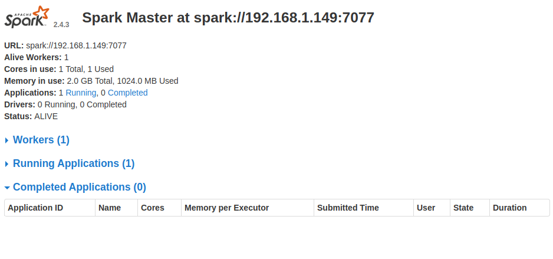

# Introducción a FP-Growth con SparkR

## Instalación de un entorno de trabajo basado en Debian

    # lsb_release -a
    No LSB modules are available.
    Distributor ID:	Debian
    Description:	Debian GNU/Linux 9.9 (stretch)
    Release:	9.9
    Codename:	stretch

### Usuario

Se definión un único usuario **spark** con password **spark**. La clave de root es la misma.

## RStudio Server

Los requerimientos de la instalación de RStudio Server pueden seguirse en la sección [download-server](https://www.rstudio.com/products/rstudio/download-server/) del sitio de [RStudio](https://www.rstudio.com).


Instalar R desde el gestor de paquetes.

    apt install r-base

Instalar RStudio descargando el paquete .deb

    apt-get install gdebi-core
    wget https://download2.rstudio.org/server/debian9/x86_64/rstudio-server-1.2.1335-amd64.deb
    gdebi rstudio-server-1.2.1335-amd64.deb


## Instalar Spark

Descargamos los binarios de Spark desde [spark.apache.org](https://spark.apache.org/downloads.html)


### Java SDK 8

    tar xvfz jdk-8u211-linux-x64.tar.gz -C /opt/

Agregar JAVA_HOME al .bashrc 

    export JAVA_HOME="/opt/jdk1.8.0_211"

Actualizar la versión de Java:

    update-alternatives --install "/usr/bin/java" "java" $JAVA_HOME/bin/java 1
    update-alternatives --install "/usr/bin/javac" "javac" $JAVA_HOME/bin/javac 1
    update-alternatives --install "/usr/bin/javaws" "javaws" $JAVA_HOME/bin/javaws 1


Verificamos la versión de Java

    java -version

    java version "1.8.0_211"
    Java(TM) SE Runtime Environment (build 1.8.0_211-b12)
    Java HotSpot(TM) 64-Bit Server VM (build 25.211-b12, mixed mode)

Descomprimimos Spark

    mkdir /usr/local/spark
    tar -xfz spark-2.4.3-bin-hadoop2.7.tgz -C /usr/local/spark

Declaramos la variable de entorno **SPARK_HOME** para eso editamos .bashrc e incorporamos al final:

    export SPARK_HOME=/usr/local/spark
    export PATH=$PATH:$SPARK_HOME/bin:$SPARK_HOME/sbin


Permisos sobre los directorios:

 - **logs**: Requerido por el master
 - **work**: Requerido por el slave

Cambiamos la propiedad del directorio logs al usuario **spark**:

    chown -R spark /usr/local/spark/logs

Cambiamos la propiedad del directorio work al usuario **spark**:

    mkdir /usr/local/spark/work
    
    chown -R spark /usr/local/spark/work


Ahora podemos poner a correr el spark-master.sh:

    spark-master.sh --host <IP-MASTER>

Y ponemos a correr un Worker con spark-slave.sh

    spark-slave.sh --host <IP_SLAVE> spark://<IP-MASTER>:7077


Nos podemos comunicar a la interfaz de usuario en <IP-MASTER>:8080, nos aparecerá esta Web UI.




## Configuraciones adicionales

### Script para 

    sudo ln -s /etc/init.d/start-spark-framework  /etc/dhcp/dhclient-exit-hooks.d/start-spark-framework

## Ejemplo de FP-Growth con SparkR

```R
library(stringr)
library(dplyr)
library(arules)
library(SparkR)

spc = sparkR.session(master = "spark://192.168.1.149:7077", 
                     sparkEnvir = list(spark.driver.memory="3g"))

# Discretizamos IRIS. Si usan arules v1.6 o superior pueden utilizar discretizeDF 
df.iris1 = iris
df.iris1$Sepal.Length <- discretize(iris$Sepal.Length, categories = 3, labels = c("bajo","medio","alto")) 
df.iris1$Sepal.Width <- discretize(iris$Sepal.Width, categories = 3, labels = c("bajo","medio","alto")) 
df.iris1$Petal.Length <- discretize(iris$Petal.Length, categories = 3, labels = c("bajo","medio","alto")) 
df.iris1$Petal.Width <- discretize(iris$Petal.Width, categories = 3, labels = c("bajo","medio","alto")) 

# Función que pasa a transacciones
as_transaction = function(r){
  return(paste(paste(names(r),r,sep = "="), collapse = ','))
}

data.trans = as.data.frame(apply(df.iris1, 1, as_transaction))
names(data.trans) = c("items")
head(data.trans)

# Crea el Objeto SparkDataFrame
df.iris.items = createDataFrame(data.trans, schema = c("items"))

# Hace la conversión a transacciones
data <- selectExpr(df.iris.items, "split(items, ' ') as items")

# Configuración del Modelo FP-Growth
model = spark.fpGrowth(data = data, minSupport=0.1, minConfidence = 0.1)

# Búsqueda de Itemset Fecuentes
frequent_itemsets = spark.freqItemsets(model)

# Mostrar Itemsets Frecuentes
showDF(frequent_itemsets, truncate = F)

# Mostrar Reglas
association_rules = spark.associationRules(model)
showDF(association_rules, truncate=F)
```

Ver archivo: [ejemplo-1.r](https://github.com/dmuba/dmuba.github.io/blob/master/Practicos/guias/Spark/ejemplo-1.r)


## Referencias

 - https://spark.apache.org/downloads.html
 - https://computingforgeeks.com/how-to-install-apache-spark-on-ubuntu-debian/
 - https://spark.apache.org/docs/latest/ml-frequent-pattern-mining.html
 - https://spark.apache.org/docs/latest/api/R/spark.fpGrowth.html

